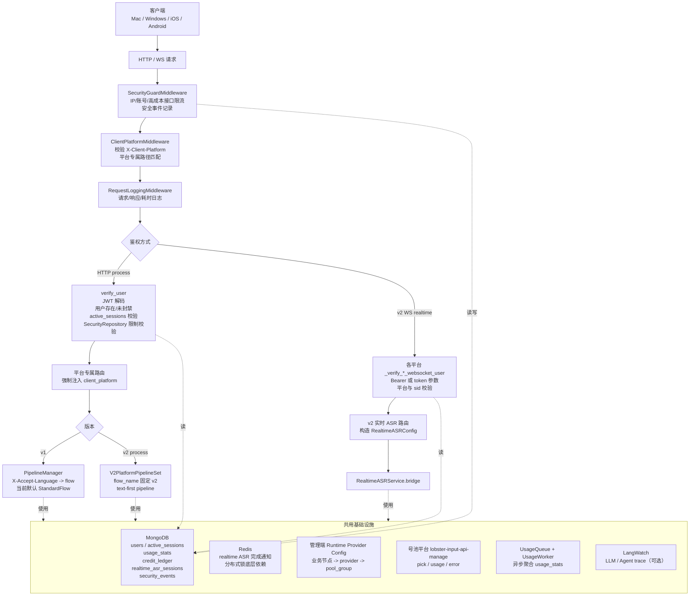
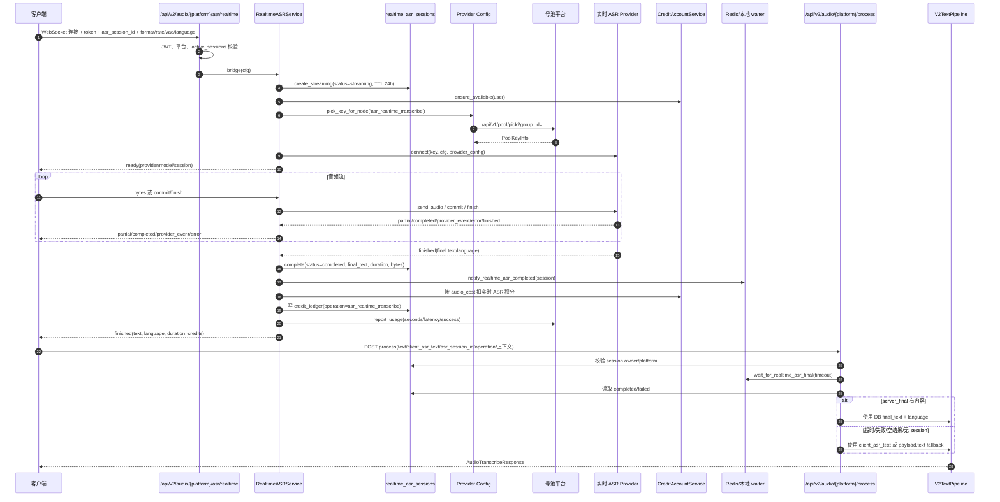
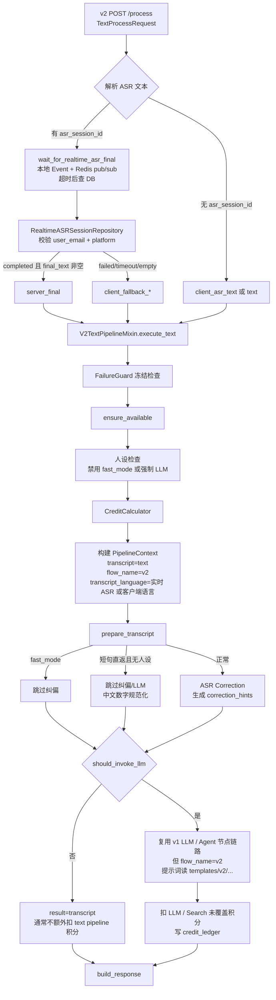
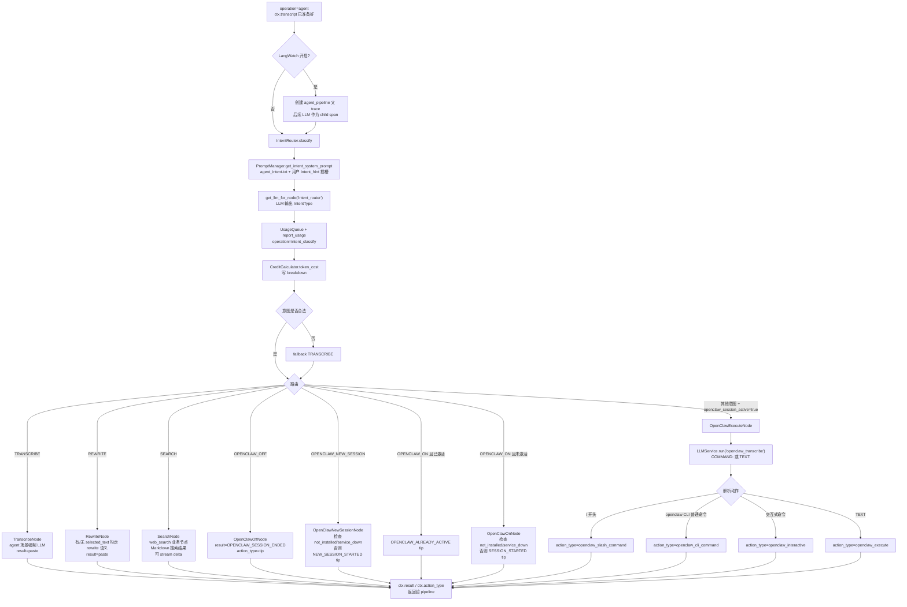
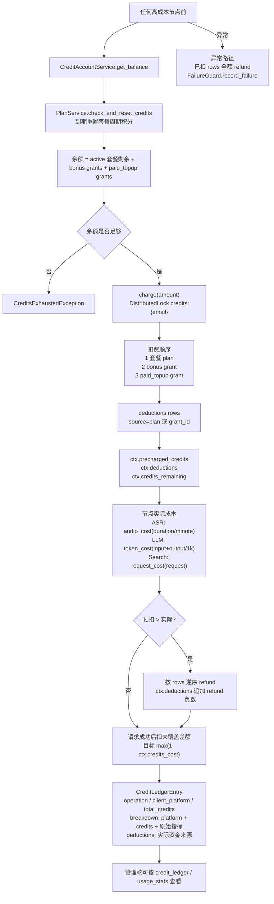
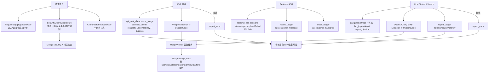

# 后端多平台语音识别业务流程图（v1 / v2）

本文基于 `lobster-input-backend/backend/app` 当前代码整理，覆盖 Mac、Windows、iOS、Android 的 v1 文件上传语音识别接口与 v2 实时语音识别接口，并标出共用组件、积分、监控、号池、提示词、人设、用户词典纠偏等关键节点。

## 1. 接口矩阵

| 版本 | 平台 | 入口 | 输入形态 | 支持 operation | 关键差异 |
|---|---|---|---|---|---|
| v1 | Mac | `POST /api/v1/audio/mac/process` | 音频文件 `multipart/form-data` | `transcribe` / `rewrite` / `agent` | 桌面完整能力，支持 OpenClaw、剪贴板结构化内容、agent 流式搜索 |
| v1 | Windows | `POST /api/v1/audio/windows/process` | 音频文件 `multipart/form-data` | `transcribe` / `rewrite` / `agent` | 与 Mac 桌面链路基本一致，平台模板走 `windows` |
| v1 | iOS | `POST /api/v1/audio/ios/process` | 音频文件 `multipart/form-data` | `transcribe` / `rewrite` | 输入法链路，不支持 agent / OpenClaw |
| v1 | Android | `POST /api/v1/audio/android/process` | 音频文件 `multipart/form-data` | `transcribe` / `rewrite` | 输入法链路，不支持 agent / OpenClaw |
| v1 | Mac / Windows | `POST /api/v1/audio/{mac,windows}/process/stream` | 音频文件 `multipart/form-data` | `agent` | 只用于 agent 搜索节点增量输出 |
| v2 | 全平台 | `WS /api/v2/audio/{platform}/asr/realtime` | WebSocket 音频流 | 实时 ASR | 只做实时识别、会话落库、ASR 扣费、号池上报 |
| v2 | 全平台 | `POST /api/v2/audio/{platform}/process` | JSON 文本 / `asr_session_id` | Mac/Windows: `transcribe` / `rewrite` / `agent`; iOS/Android: `transcribe` / `rewrite` | 从实时 ASR 会话取最终文本，再进 text-first pipeline |
| v2 | Mac / Windows | `POST /api/v2/audio/{mac,windows}/process/stream` | JSON 文本 / `asr_session_id` | `agent` | 只用于 agent 搜索节点增量输出 |

## 2. 总览：所有请求进入后的公共外围链路

## 3. v1 文件上传语音识别主流程

```mermaid
flowchart TD
  Start["v1 POST /api/v1/audio/{platform}/process\nmultipart: file + operation + 上下文"] --> ValidateOp{"operation 是否允许"}
  ValidateOp -->|不允许| BadReq["400\n平台能力限制"]
  ValidateOp -->|允许| SelectPipeline["PipelineManager.get_pipeline\nclient_ui_lang = X-Accept-Language\nflow_name = standard\nplatform -> PlatformPipelineSet"]

  SelectPipeline --> Execute["AudioProcessPipeline.execute"]
  Execute --> Freeze["FailureGuard.is_frozen\n连续失败冻结检查"]
  Freeze --> CreditPrecheck["CreditAccountService.ensure_available\n套餐 + bonus + paid_topup 总余额 > 0"]
  CreditPrecheck --> Persona["PersonaRepository.get_active_prompts\ntranscribe/rewrite 激活人设会强制 LLM\n并禁用 transcribe fast_mode"]
  Persona --> Ratio["PlanRepository.get_platform_credit_ratio\n初始化 CreditCalculator"]
  Ratio --> Save["AudioService.save_upload\n格式/大小/时长校验\n超时长返回 config_update"]
  Save --> Enhance["AudioService.enhance\nffmpeg 高通 + loudnorm\n失败直通原音频"]

  Enhance --> ASRPrecharge["估算 ASR 积分\n按最长 ASR minute 规则预扣\nCreditAccountService.charge"]
  ASRPrecharge --> ASR["AudioService.transcribe"]

  subgraph FileASR["文件 ASR 共用链路"]
    ASR --> Hotwords["构造 ASR prompt\n默认热词 + 用户 HotWordRepository"]
    Hotwords --> PickASR["pick_key_for_node('asr_transcribe')\n管理端 runtime config\n-> 号池 pick_key"]
    PickASR --> ProviderASR{"ASR provider"}
    ProviderASR --> DashScope["dashscope / qwen_asr\nQwen3-ASR-Flash"]
    ProviderASR --> OpenAICompat["openai / groq\nOpenAI 兼容 Whisper API"]
    ProviderASR --> Volc["volcengine / doubao\n火山豆包语音"]
    DashScope --> ASRResult["ASRResult\ntext + language"]
    OpenAICompat --> ASRResult
    Volc --> ASRResult
    ASRResult --> PoolUsageASR["report_usage 到号池\nseconds_used / latency / client_platform"]
    ASRResult --> UsageASR["WhisperExtractor -> UsageQueue\n异步写 usage_stats"]
    ProviderASR -->|异常| PoolErrASR["report_error 到号池\nFailureGuard 记录失败\n已预扣积分退款"]
  end

  ASRResult --> ASRCost["CreditCalculator.audio_cost\n写 ctx.credits_breakdown\n多预扣则退款"]
  ASRCost --> CorrectionDecision{"是否跳过纠偏"}
  CorrectionDecision -->|fast_mode| SkipCorrection["跳过用户词典纠偏\n跳过 LLM"]
  CorrectionDecision -->|transcribe 短句直返且无人设| ShortDirect["中文数字规范化\n跳过纠偏和 LLM"]
  CorrectionDecision -->|正常| ASRCorrection["ASR Correction Service\n用户词典发音候选召回\n生成 correction_hints\nhas_correction_hints=True"]

  SkipCorrection --> LLMDecision
  ShortDirect --> LLMDecision
  ASRCorrection --> LLMDecision{"should_invoke_llm"}
  LLMDecision -->|否| DirectResult["result = transcript"]
  LLMDecision -->|是| LLMPrecharge["估算 LLM 积分\nagent 乘以 3\n预扣"]
  LLMPrecharge --> LLMRun["invoke_llm / AgentPipeline.invoke_llm"]

  subgraph LLMCommon["LLM 共用链路"]
    LLMRun --> Prompt["PromptManager\n路径 templates/{flow}/{lang}/{platform}/{operation}.txt\n语言来自 ASR language\n平台 mac/ios/windows/android\n人设可替换 transcribe/rewrite prompt"]
    Prompt --> PickLLM["get_llm_for_node\noperation -> 业务节点\ntranscribe: llm_transcribe\nrewrite: llm_rewrite\nopenclaw: openclaw_transcribe"]
    PickLLM --> LLMProvider["build_llm\nprovider implementation + key + base_url + model"]
    LLMProvider --> Messages["构造 messages\nvoice_text / selected_text / clipboard / correction_hints / history / length_hint"]
    Messages --> AgentFactory["AgentFactory.run\n普通 LLM / rewrite tools / agent 节点"]
    AgentFactory --> LLMUsage["OpenAI/Groq Extractor -> UsageQueue\nreport_usage 到号池"]
    AgentFactory -->|异常| LLMErr["report_error 到号池\n预扣退款\nFailureGuard 记录失败"]
  end

  LLMUsage --> LLMCost["CreditCalculator.token_cost\n写 ctx.credits_breakdown\n多预扣则退款"]
  LLMCost --> Memory["ConversationMemory.add_turn\n按 operation namespace 隔离"]
  DirectResult --> Memory

  Memory --> Action["resolve_action_type\n普通 transcribe/rewrite: paste\nagent: 由节点决定"]
  Action --> ChargeFinal["CreditAccountService._charge_uncovered_credits\n目标 max(1, credits_cost)\n扣除未预扣覆盖差额"]
  ChargeFinal --> Ledger["CreditLedgerRepository.insert\noperation / platform / total_credits\nbreakdown / deductions"]
  Ledger --> Success["FailureGuard.record_success\ncleanup 临时音频"]
  Success --> Response["AudioTranscribeResponse\noperation/action_type/transcript/result\nwarning/config_update/clarify_question\ncredits_remaining/agent_intent"]
```

## 4. v2 实时 ASR + 文本处理流程

v2 分为两个阶段：第一阶段 WebSocket 实时 ASR，只负责流式识别和 ASR 扣费；第二阶段 HTTP `/process` 使用 `asr_session_id` 解析最终文本，再进入 text-first pipeline。

## 5. v2 text-first pipeline 细节

> 注意：v2 的实时 ASR 已在 WebSocket 阶段单独扣 `asr_realtime_transcribe` 积分；HTTP text pipeline 不再重复做文件 ASR 扣费，只对纠偏后需要的 LLM / Search 等后续节点扣费。

## 6. Agent 分支流程（Mac / Windows）

Mac 和 Windows 的 v1 / v2 都支持 `agent`。v1 先走文件 ASR 得到 transcript；v2 先走实时 ASR 最终文本。进入 AgentPipeline 后，分支一致。

移动端 v1/v2 路由层当前不放行 `agent`，所以 iOS/Android 不会进入这张图。

## 7. 积分与账本流程

### 扣费节点归类

| 节点 | 业务节点 / operation | 计费单位 | 账本 breakdown platform 示例 |
|---|---|---|---|
| v1 文件 ASR | `asr_transcribe` | minute | `{platform_code}_asr` |
| v2 实时 ASR | `asr_realtime_transcribe` | minute | `{platform_code}_asr_realtime` |
| 普通纠偏整理 | `llm_transcribe` | 1k tokens | `{platform_code}_llm` |
| 改写 | `llm_rewrite` | 1k tokens | `{platform_code}_llm` |
| Agent 意图分类 | `intent_router` | 1k tokens | `{platform_code}_llm` |
| OpenClaw 语音命令精炼 | `openclaw_transcribe` | 1k tokens | `{platform_code}_llm` |
| 联网搜索 | `web_search` | request，外加可能的 token 用量统计 | 搜索 provider 自己写入 request cost / usage |

## 8. 监控、用量与可观测性

## 9. 共用节点清单

### 所有平台、所有版本共用

- `SecurityGuardMiddleware`：接口风控、限流、限制检查。
- `ClientPlatformMiddleware`：`X-Client-Platform` 校验与平台专属路径匹配。
- `RequestLoggingMiddleware`：请求日志。
- `verify_user` / v2 WS `_verify_*_websocket_user`：JWT、用户状态、active session 校验。
- `CreditAccountService`：余额检查、扣费、退款。
- `CreditCalculator`：按管理端规则换算积分。
- `CreditLedgerRepository`：成功扣费账本。
- `UsageQueue` / `UsageWorker` / `UsageRepository`：异步用量统计。
- `runtime_provider_config.pick_key_for_node`：从管理端运行时配置解析业务节点和 provider，再到号池取 key。
- `api_pool_client.report_usage/report_error`：上报号池用量和错误。
- `PromptManager`：按 `flow_name + transcript_language + platform + operation` 读取提示词。
- `PersonaRepository`：人设提示词与 intent hint。
- `ConversationMemory`：transcribe / rewrite / agent 分 namespace 记忆。
- `FailureGuard`：连续失败冻结与恢复。
- `ASR Correction`：用户词典纠偏 hints。

### v1 文件 ASR 专用

- `AudioService.save_upload`：保存、格式/大小/时长校验。
- `AudioService.enhance`：ffmpeg 音频增强。
- `AudioService.transcribe`：文件 ASR，业务节点 `asr_transcribe`。
- `providers/asr/*`：DashScope、OpenAI 兼容、Volcengine 文件 ASR provider。

### v2 实时 ASR 专用

- `RealtimeASRService.bridge`：客户端 WS 与 provider WS 桥接。
- `RealtimeASRSessionRepository`：实时识别会话状态和最终文本，TTL 24h。
- `realtime_asr_session_waiter`：本地事件 + Redis pub/sub 等待最终文本。
- `providers/realtime_asr/*`：DashScope realtime、Volcengine realtime provider。
- 业务节点 `asr_realtime_transcribe`：实时 ASR 号池和计费节点。

### 桌面端 Mac / Windows 共用

- `AgentPipeline`：`agent` 多意图路由。
- `IntentRouter`：意图分类业务节点 `intent_router`。
- `TranscribeNode` / `RewriteNode` / `SearchNode`。
- `OpenClawOnNode` / `OpenClawOffNode` / `OpenClawNewSessionNode` / `OpenClawExecuteNode`。
- `/process/stream`：仅 agent 搜索节点输出 delta。

### 移动端 iOS / Android 共用

- v1：`iOSTranscribePipeline` / `AndroidTranscribePipeline` 当前都继承基础 `AudioProcessPipeline`。
- v1：`iOSRewritePipeline` / `AndroidRewritePipeline` 当前都继承 `RewritePipeline`。
- v2：`IOS_V2_PIPELINES` / `ANDROID_V2_PIPELINES` 只注册 `transcribe` 和 `rewrite`，不注册 `agent`。

## 10. 代码位置索引

| 模块 | 位置 |
|---|---|
| FastAPI 入口与全局中间件 | `backend/app/main.py` |
| v1 平台路由 | `backend/app/api/v1/audio/{mac,windows,ios,android}.py` |
| v2 平台路由与 realtime WS | `backend/app/api/v2/audio/{mac,windows,ios,android}.py` |
| v1 pipeline 选择 | `backend/app/services/pipeline/flow/*` |
| v1 pipeline 实现 | `backend/app/services/pipeline/v1/*` |
| v2 text-first pipeline | `backend/app/services/pipeline/v2/*` |
| 文件 ASR 服务 | `backend/app/services/audio/audio_service.py` |
| 实时 ASR bridge | `backend/app/services/audio/realtime_asr.py` |
| 实时 ASR 会话等待 | `backend/app/services/audio/realtime_asr_session_waiter.py` |
| 文件 ASR provider | `backend/app/providers/asr/*` |
| 实时 ASR provider | `backend/app/providers/realtime_asr/*` |
| LLM 服务 | `backend/app/services/llm/llm_service.py` |
| Agent 意图与节点 | `backend/app/agent/intent_router.py`, `backend/app/agent/nodes/*` |
| Prompt 路由 | `backend/app/prompts/prompt_manager.py` |
| 积分账户与计算 | `backend/app/services/billing/credit_account_service.py`, `backend/app/services/billing/credit_calculator.py` |
| 积分账本模型 | `backend/app/data/credits/models.py` |
| 号池与运行时配置 | `backend/app/services/infra/api_pool_client.py`, `backend/app/services/infra/runtime_provider_config.py` |
| 用量统计队列 | `backend/app/data/usage/queue.py`, `backend/app/data/usage/repository.py` |
| 风控与平台校验 | `backend/app/middleware/security_guard.py`, `backend/app/middleware/client_platform.py`, `backend/app/middleware/auth.py` |
