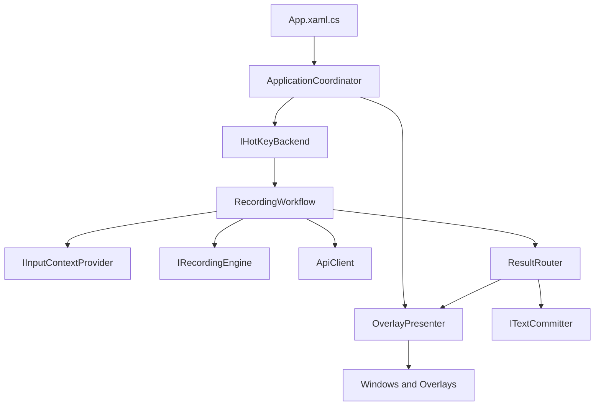

# Windows 输入法架构重构方案

本文档记录 Windows 端后续重构边界。项目尚未上线，因此优先选择清晰、稳定、可维护的主路径实现，不为了兼容旧实现保留多套并行方案。

## 重构原则

1. 单一主路径优先
   - 每个核心能力只保留一个默认实现，例如托盘只使用原生 `System.Windows.Forms.NotifyIcon`，更新只使用 Velopack。
   - 只有 Windows 平台确实存在不可控差异时，才允许 Strategy 插拔不同实现。插拔点必须有接口、日志和验收说明。

2. 业务工作流与系统能力分离
   - 热键触发、录音状态机、上下文采集、服务端请求、结果回填、浮窗展示必须分层。
   - UI 层只订阅状态和展示结果，不直接调系统 API。

3. 以设计模式管理变化
   - Coordinator: 管理应用生命周期、窗口流转、后台任务。
   - Presenter: 管理浮窗展示，不让业务工作流持有具体窗口。
   - Strategy: 管理可替换的 Windows 能力，例如热键后端、文本回填、截图确认。
   - Adapter: 包装 Win32、UIAutomation、NAudio、Velopack 等第三方或系统 API。
   - State Machine: 管理录音、处理中、取消、失败、完成状态，避免多个布尔值互相打架。

4. 用户体验不能回退
   - 后台运行必须一直保留托盘入口，用户能从托盘显示主界面、进入设置、检查更新、切换麦克风、退出。
   - 识别中浮窗在提交录音后立即进入处理中状态，结果成功回填后立即消失。
   - 能定位并写入第三方输入框时必须回填，不能回填、目标不可编辑、搜索结果、Markdown 结果才用浮窗。

## 必须保留的功能细节

### 账号与窗口流程

- 未登录展示登录窗口。
- 需要邀请码时展示邀请码窗口。
- 首次登录后展示引导窗口。
- 完成引导后展示主窗口。
- 主窗口关闭后应用后台运行，托盘继续存在。
- 退出登录后停止全局热键、清空当前识别结果、回到登录或邀请码流程。

### 全局热键

- 默认热键按账号维度保存，不同账号互不污染。
- 默认组合：
  - 语音转文字: `Alt+Q`
  - 改写选中文本: `Alt+W`
  - Agent 智能操作: `Alt+E`
  - 截图: `Alt+R`
- 引导页、首页、设置页和托盘展示的热键必须来自同一份配置。
- 热键监听后台生效，但不能接管键盘，也不能让其它应用输入框失焦。

### 录音与识别

- 应用启动和登录后预热录音引擎。
- 麦克风默认使用系统通信设备。
- 用户手动选择麦克风后必须保持选择，只有设备消失时才回退默认设备。
- 麦克风列表过滤虚拟设备、聚合设备、Loopback、Monitor、Stereo Mix 等非用户输入设备。
- 录音浮窗展示音波和倒计时。
- 二次按快捷键时立即切换到处理中状态。
- 处理期间允许取消，并正确落历史状态。

### 上下文采集

- 录音开始时异步采集目标窗口、选中文本、剪贴板上下文和截图上下文。
- 识别结束提交服务端前只等待已经开始的采集任务，不在主线程做阻塞操作。
- 选中文本和剪贴板是两类不同上下文，不能互相替代。
- 自家引导页输入框和第三方输入框都必须走同一套目标识别逻辑，避免同一结果既回填又弹窗。

### 结果投递

- 可编辑目标优先直接回填。
- 不可编辑目标、无法确认写入的目标、搜索结果、Markdown 结果使用浮窗。
- 回填成功后识别中浮窗立即关闭。
- 回填失败时展示结果浮窗，且历史记录中保留可重试信息。
- 大文本回填不能出现“回填成功又弹窗”的双结果。

### 浮窗与截图

- 录音浮窗底部居中，保持 mac 端同等视觉等级。
- 改写结果浮窗和搜索结果浮窗是不同布局。
- 结果浮窗支持移动和调整大小。
- 二次截图确认需要有遮罩，选择框可拖动和调整大小。

### 设置、历史和国际化

- 词典、人设、历史、设置页面按 mac 端信息架构对齐。
- 可开关项使用统一滑动开关，不使用默认复选框。
- 历史记录支持保存时间、隐私提示、重试和结果查看。
- 登录页、引导页、主窗口、托盘、浮窗、错误提示全部走统一国际化。
- 国际化文案按语言文件拆分，不把多语言混入一个文件。

### 更新与安装

- 在线更新使用 Velopack。
- 正式安装包使用 Inno Setup 包装 Velopack 安装器。
- 安装包支持自定义安装目录、重复安装检测、卸载入口和程序目录内卸载程序。
- 发布文档区分 preview 和 prod 环境。

## 目标分层



## 当前已落地

- `App.xaml.cs` 已缩减为应用入口、单实例锁和退出清理。
- 新增 `Lifecycle/ApplicationCoordinator.cs`，集中管理窗口流转、登录状态、后台任务、托盘初始化和用户会话启动。
- 新增 `Lifecycle/OverlayPresenter.cs`，集中管理录音、结果、澄清、提示浮窗，以及热键事件到业务处理器的接线。
- 新增 `Services/HotKeys/IHotKeyBackend.cs` 和 `Services/HotKeys/LowLevelKeyboardHookBackend.cs`，热键监听后端已按 Strategy 拆分。
- `Services/HotKeyService.cs` 现在只负责账号级热键配置、持久化、默认值升级和事件分发。
- 新增 `Workflows/RecordingWorkflow.cs`，录音流程已从 `HotKeyHandler` 迁出，并使用 `RecordingWorkflowState` 管理启动、录音、停止、处理状态。
- `Services/HotKeyHandler.cs` 已降级为门面，历史记录重试、首页重试和全局热键都委派到同一条录音工作流。
- 新增 `Services/TextTargets/TextTargetService.cs`，文本目标识别和回填现在有统一入口与 `TextCommitResult`。
- 新增 `Services/TextTargets/TextTargetWin32.cs`，Win32 焦点、选区、前台窗口和 `SendInput` 细节集中在单一系统边界内。
- 回填主路径收敛为剪贴板 + `SendInput`，删除旧的 `keybd_event` 和 `WM_PASTE` 兜底路径。
- 新增 `Services/Audio/AudioDeviceService.cs` 和 `Services/Audio/AudioPostProcessor.cs`，麦克风设备策略、录音引擎、音频后处理已拆分。
- 新增 `Services/Screenshot/ScreenCaptureService.cs` 和 `Services/Screenshot/ScreenshotSelectionWindow.cs`，截图捕获和选择框 UI 已拆分。
- 托盘已使用单一路径 `System.Windows.Forms.NotifyIcon`，移除 `H.NotifyIcon.Wpf` 依赖。
- 在线更新已使用单一路径 Velopack，正式安装包使用 Inno Setup 外层安装器。
- Windows 权限伪模块已移除，录音能力由录音引擎真实启动结果决定，不再保留 macOS 权限流程的占位兼容层。
- 热键监听和热键录制共享 `KeyboardHookInterop`，但保留两个业务服务：全局监听负责吞键和分发，设置页录制负责采集组合键。
- 浮窗窗口样式、移动、缩放的 Win32 调用集中到 `Helpers/WindowInteropTools.cs`。
- 剪贴板写入集中到 `ClipboardService`，页面和浮窗不再直接调用 WPF `Clipboard.SetText/SetImage`。
- 项目文件移除旧式 UIAutomation 引用，Debug 构建已达到 0 警告 0 错误。

## 后续重构阶段

### Phase 1: 热键后端 Strategy

目标文件:
- `Services/HotKeyService.cs`
- 新增 `Services/HotKeys/IHotKeyBackend.cs`
- 新增 `Services/HotKeys/LowLevelKeyboardHookBackend.cs`

状态: 已完成基础拆分。

已完成:
- `HotKeyService` 只管理账号级配置、保存、加载和事件分发。
- 低级键盘钩子移动到后端实现。

后续优化:
- 后续如切换到 `RegisterHotKey` 或其它方案，只替换后端，不影响业务工作流。
- 去掉散落在服务里的兼容布尔值，把“是否吞掉系统按键”作为后端能力明确表达。

### Phase 2: 录音工作流 State Machine

目标文件:
- `Services/HotKeyHandler.cs`
- 新增 `Workflows/RecordingWorkflow.cs`
- `RecordingSession` 作为工作流内部会话模型管理单次录音上下文

状态: 已完成基础拆分。

已完成:
- 使用明确状态替代 `_isStartingRecording`、`_isStopAndProcessInFlight`、`_processingRecordId` 等分散状态。
- 录音开始、停止、提交、取消、失败、完成都有唯一入口。
- UI 状态先行，耗时任务后台执行。

### Phase 3: 文本目标识别与回填 Strategy

目标文件:
- `Services/SelectedTextService.cs`
- 新增 `Services/TextTargets/ITextTargetService.cs`
- 新增 `Services/TextTargets/TextTargetService.cs`
- 新增 `Services/TextTargets/TextCommitResult.cs`

状态: 已完成统一入口和 Win32 边界拆分，后续可继续细分 reader/committer。

已完成:
- `TextTargetService` 统一处理当前进程调度、STA 调度、不可编辑判断、回填结果原因。
- 业务工作流不再直接调用 `SelectedTextService.PasteText`。
- 回填策略链路收敛为：当前进程 WPF 直写 -> Win32 原生输入框 `EM_REPLACESEL` 直写 -> 已确认可编辑目标的剪贴板粘贴。
- `TextTargetWin32` 统一管理前台窗口、目标线程、Win32 Edit 选区读取和粘贴快捷键发送。
- Win32 原生输入框不依赖 Ctrl+V，避免系统拒绝 `SendInput` 时只能弹出结果浮窗。
- 剪贴板粘贴仍作为非 Win32 输入框的主路径；当 `SendInput` 被 Windows 拒绝时，键盘事件兼容只封装在 `TextTargetWin32` 系统适配器内，不泄露到业务层。

后续优化:
- 拆分读取选中文本和写入目标文本。
- WPF 当前进程、Win32 Edit、UIAutomation、剪贴板粘贴分别作为策略。
- 目标不可编辑时已经直接返回不可写；后续只需要把这个判断从服务门面继续下沉到策略结果。
- `TextCommitResult` 已统一成功、失败原因；后续可扩展为包含“建议浮窗类型”。

### Phase 4: 截图服务拆分

目标文件:
- `Services/ScreenshotService.cs`
- 新增 `Services/Screenshot/ScreenCaptureService.cs`
- 新增 `Services/Screenshot/ScreenshotSelectionWindow.cs`

状态: 已完成。

已完成:
- 截图捕获、选择框 UI、二次确认 UI、剪贴板写入分离。
- 二次确认框使用统一遮罩、拖动和缩放行为。

### Phase 5: 音频设备和录音引擎拆分

目标文件:
- `Services/AudioRecorderService.cs`
- 新增 `Services/Audio/AudioDeviceService.cs`
- 新增 `Services/Audio/AudioPostProcessor.cs`
- 后续可新增 `Services/Audio/WasapiRecordingEngine.cs`

状态: 已完成设备策略和音频后处理拆分，WASAPI 引擎仍保留在 `AudioRecorderService` 中。

已完成:
- 设备枚举和过滤独立管理。
- 音频编码、降噪、静音检测独立测试。

后续优化:
- WASAPI 录音引擎可继续从 `AudioRecorderService` 拆成 `WasapiRecordingEngine`，但目前业务状态和预热行为已保持稳定。

## 验收命令

```powershell
dotnet build .\LobsterInput.sln -c Debug
Start-Process .\LobsterInput\bin\Debug\net8.0-windows\LobsterInput.exe
```

正式安装包生成:

```powershell
.\scripts\release-windows-velopack.ps1 -Environment preview -Version <version>
```
